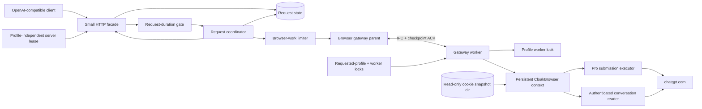
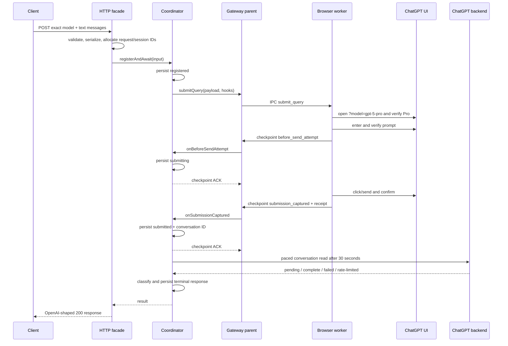

# Minimal OpenAI-Compatible Endpoint for `gpt-5.6-sol-pro`

> **Audience:** a coding agent extracting the ChatGPT provider from `surf-cli` into a small standalone service.  
> **Deliverable described here:** an isolated Node.js HTTP service serving one model.  
> **Recommended first deployment:** one authenticated profile, one active request, no queue, text-only, non-streaming.  
> **Repository evidence:** audited from the working tree on `master`; paths below are relative links to this repository.

---

## 1. Scope, warning, and success criteria

This guide describes how to expose the existing browser-backed ChatGPT integration through a narrow OpenAI-shaped HTTP surface:

- `POST /v1/chat/completions`
- `GET /v1/models`
- `GET /healthz`
- `GET /readyz`
- optional hardening: `GET /v1/results?request_id=...`

The endpoint accepts only the exact public model ID `gpt-5.6-sol-pro`. It deliberately excludes streaming, tools, attachments, images, `n > 1`, aliases, conversation continuation, and every other provider.

### Important policy and stability caveat

This is **not the official OpenAI API**. It automates the ChatGPT web application and reads browser-authenticated private backend endpoints. DOM selectors, UI labels, model URL parameters, conversation schemas, and private endpoints can change without notice. Automation of a consumer ChatGPT account may be restricted by applicable terms, account policy, or organizational policy. Review those constraints before deployment, keep access private, and never market this endpoint as official or protocol-equivalent to OpenAI.

The isolated endpoint also flattens chat roles into one textual browser prompt. A `system` message is therefore context text, not a privileged transport channel. Unsupported OpenAI parameters must be rejected rather than silently ignored.

### Falsifiable acceptance criteria

A correct implementation must demonstrate all of the following on the real container and real HTTP surface:

1. `GET /v1/models` returns exactly one model with `id: "gpt-5.6-sol-pro"`.
2. The aliases `pro`, `gpt-5-pro`, and `o1-pro` are rejected with HTTP 400.
3. A valid non-streaming request returns HTTP 200, a non-empty assistant message, and the exact canonical model ID.
4. A second concurrent synchronous POST is rejected with HTTP 429 and `Retry-After`. This is enforced by an **outer request-duration gate** held until the POST settles; a separate browser-work limiter serializes UI submissions and paced reads.
5. `stream: true`, tools, attachments, continuation IDs, and `n > 1` are rejected before browser work.
6. Missing or insecure cookies make `/readyz` return 503 without launching a browser or sending a prompt.
7. Every accepted Layer A request crosses one parent-acknowledged pre-send checkpoint and at most one send attempt in that process. Crash-durable checkpoint guarantees begin in Layer B.
8. After a receipt or any ambiguous send evidence, process/network failure causes read-only recovery—never a fresh send.
9. With Layer B enabled, a process restart during remote generation recovers through `/v1/results` with `sendAttemptCount === 1`.
10. Logs, state, test fixtures, image layers, and verification artifacts contain no cookie values, service bearer tokens, or authorization headers.

---

## 2. What the current repository actually does

### 2.1 Model mapping

The model catalog maps the canonical endpoint ID to the ChatGPT Pro UI:

```text
gpt-5.6-sol-pro
  mode:             pro
  URL model param:  gpt-5-pro
  UI label:         Pro
  UI model label:   GPT-5.6 Sol
  reasoning effort: pro only
```

This is directly defined in [`native/chatgpt-models.cjs`](../native/chatgpt-models.cjs#L99-L129). The same catalog contains historical and convenience aliases. The isolated HTTP boundary should reject those aliases even though the internal resolver understands them; this prevents the public contract from drifting.

### 2.2 Production request path

The current end-to-end path is:

```text
POST /v1/chat/completions
  │
  ├─ HTTP validation, auth, OpenAI error mapping
  │    native/http-server.cjs
  │
  ├─ query/session adapter
  │    native/chatgpt-cloak-query-service.cjs
  │
  ├─ durable request owner
  │    native/chatgpt-request-coordinator.cjs
  │
  ├─ reusable child-process gateway + acknowledged IPC checkpoints
  │    native/chatgpt-browser-gateway.cjs
  │
  ├─ persistent CloakBrowser worker, profile lock, page lanes, cookie injection
  │    native/chatgpt-browser-gateway-worker.mjs
  │
  ├─ exact model selection, verified prompt entry, send confirmation, receipt
  │    native/chatgpt-cloak-submit-executor.mjs
  │
  ├─ authenticated private-backend conversation reads
  │    native/chatgpt-conversation-fetch-executor.mjs
  │
  ├─ terminal/progress/failure classification
  │    native/chatgpt-conversation-state.cjs
  │
  └─ persisted result → OpenAI-shaped response or /v1/results
```

The production server in [`native/http-server.cjs`](../native/http-server.cjs) is a large multi-provider composition root. Do not copy it wholesale. Its useful reference slices are request validation, error mapping, composition, health, result polling, and its post-send retry gate.

### 2.3 Component diagram



### 2.4 Happy-path sequence



The acknowledged checkpoint protocol is load-bearing. The parent must durably persist the pre-send state before the worker is allowed to send, and durably persist the receipt before later result state is trusted.

---

## 3. Ownership, state, and invariants

### 3.1 Ownership boundaries

| Concern | Sole owner | Reason |
|---|---|---|
| Public schema and HTTP status | HTTP facade | Keeps browser details out of clients |
| Exact public model policy | HTTP facade | Internal catalog aliases must not leak |
| Outstanding synchronous HTTP requests | Request-duration gate | Holds capacity until the POST settles |
| UI submissions and backend reads | Browser-work limiter | Owns provider pacing and dynamic cooldown |
| Request identity and state transitions | Coordinator | Makes duplicate prevention deterministic |
| Durable metadata and response artifact | Session store | Supports restart and result polling |
| Browser child lifecycle and checkpoint ACK | Gateway parent | Separates process failure from send state |
| Persistent context, pages, cookie injection | Gateway worker | One browser owner per profile |
| DOM/model/prompt/send mechanics | Submission executor | Fragile UI logic stays isolated |
| Remote completion state | Conversation classifier | Reasoning/tool nodes must not look terminal |
| Cross-process server exclusivity | Profile-independent global lease | Profile aliases cannot safely identify the authenticated account |
| Worker/profile exclusivity | Requested-profile lease + worker lock | Prevents overlapping browser writers inside the owner server |
| Cookie creation | Trusted host exporter | Container never decrypts a host Chrome DB |

### 3.2 Typed domain model

The standalone project should define the shape before the logic. The following is intentionally small and can be copied into TypeScript.

```ts
// COPYABLE
export const PUBLIC_MODEL = "gpt-5.6-sol-pro" as const;

export type RequestState =
  | "registered"
  | "submitting"
  | "submitted"
  | "completed"
  | "failed"
  | "timed_out"
  | "cancelled"
  | "submission_ambiguous";

export type SendDisposition = "not_attempted" | "ambiguous" | "confirmed";

export interface ValidatedRequest {
  model: typeof PUBLIC_MODEL;
  prompt: string;
  reasoningEffort: "pro";
  timeoutMs: number;
}

export interface SubmissionReceipt {
  sendConfirmed: true;
  baselineCaptured: true;
  conversationId: string;
  baselineAssistantMessageId: string | null;
  submittedAtMs: number;
}

export interface PersistedRequest {
  schemaVersion: 1;
  requestId: string;
  sessionId: string;
  identity: string;
  model: typeof PUBLIC_MODEL;
  state: RequestState;
  sendDisposition: SendDisposition;
  sendAttemptCount: number;
  createdAtMs: number;
  deadlineAtMs: number;
  submissionAttemptedAtMs: number | null;
  submittedAtMs: number | null;
  conversationId: string | null;
  baselineAssistantMessageId: string | null;
  terminalAtMs: number | null;
  errorCode: string | null;
}
```

> **Deliberate Layer B schema extension:** current surf-cli persistence does not expose `sendDisposition`, `sendAttemptCount`, or this flattened millisecond schema. It stores top-level request/model/conversation/checkpoint fields plus nested `coordinator.version`, identity, state, ISO timestamps, and error code. If the verifier requires `sendAttemptCount === 1`, add that counter explicitly and persist its increment atomically with `registered → submitting`; do not assume vendoring the current coordinator creates it. Keep a separate response artifact and version migrations.

### 3.3 Request state machine

```text
registered
  ├─ cancellation/deadline before checkpoint ──────────────> cancelled/timed_out
  └─ durable pre-send checkpoint ──────────────────────────> submitting
       ├─ receipt captured and persisted ──────────────────> submitted
       └─ any failure after acknowledged checkpoint ───────> submission_ambiguous

submission_ambiguous
  └─ late valid, durably acknowledged receipt ─────────────> submitted (narrow recovery transition)

submitted
  ├─ classifier says complete ─────────────────────────────> completed
  ├─ classifier says terminal failure ─────────────────────> failed
  ├─ absolute deadline ────────────────────────────────────> timed_out (read-only recovery)
  └─ transient read failure / 429 ─────────────────────────> submitted (reschedule; never resend)
```

The coordinator constructor and lifecycle are visible in [`native/chatgpt-request-coordinator.cjs`](../native/chatgpt-request-coordinator.cjs#L95-L214); request identity conflict handling and registration are in [lines 214–343](../native/chatgpt-request-coordinator.cjs#L214-L343).

### 3.4 Non-negotiable invariants

1. **No unacknowledged send:** the worker cannot click/send until the durable `before_send_attempt` checkpoint is acknowledged.
2. **No resend after evidence:** a conversation ID, send confirmation, receipt, `submissionAttemptedAtMs`, a sent checkpoint, or an ambiguous disposition permanently forbids a new UI send.
3. **Receipt validity:** a receipt requires `sendConfirmed`, `baselineCaptured`, a non-empty conversation ID, the baseline message key, and a finite submission timestamp.
4. **Terminal text validity:** only a completed assistant leaf belonging to the current turn is terminal. Reasoning, tool, recap, and child-bearing nodes are not final answers.
5. **One local server for unknown account identity:** acquire a profile-independent global ChatGPT HTTP-server lease before the requested-profile lease. Different profile aliases can still resolve to the same authenticated account.
6. **One writer per profile:** the worker holds its profile slot before browser launch. Across arbitrary containers/PID namespaces, filesystem PID locks alone are insufficient; deploy one container per credential or use an external host/cluster lease.
7. **Two admission durations:** the outer request gate is held until the synchronous POST settles; the browser-work permit covers only the submitted operation/read. Conflating them breaks the promised concurrent-request 429.
8. **Backend reads are globally paced:** never poll each request independently. The coordinator owns one active read lane, minimum spacing, and shared cooldown.
9. **Remote 429 stops local pressure:** propagate `retryAfterMs` to the coordinator, browser-work limiter, HTTP `Retry-After`, and readiness/metrics. The outer request gate is concurrency-only.
10. **Client disconnect is not cancellation after send:** continue inspection and expose the result by request ID. The coordinator cancels only when the last waiter leaves while still `registered`.
11. **Close-gated ownership:** do not release a worker slot after merely sending SIGTERM. Wait for confirmed child/process-tree close; boundedly escalate, expose `shutdown_stuck`, and never launch a replacement while teardown is unconfirmed.
12. **Readiness is side-effect free:** it may inspect config, files, leases, and in-memory status; it must not spawn, navigate, read the backend, or send.
13. **Secrets are outside request state:** cookies and endpoint bearer tokens are never persisted with sessions.

---

## 4. Minimum versus hardened architecture

A browser submission without checkpointed state is short code but is not a safe minimum. The smallest trustworthy endpoint includes the coordinator/gateway checkpoint contract. Optionality begins at crash recovery, queuing, and operations—not at duplicate-send prevention.

### Layer A: safe functional minimum

Include:

- exact-model, strict text-only HTTP facade;
- non-streaming only;
- one profile and one outstanding synchronous request;
- an outer request-duration gate with no waiting queue (`maxPending = 0`);
- a separate browser-work limiter for UI/read operations and cooldown;
- profile-independent global server lease, requested-profile lease, and worker lock;
- secure cookie snapshot loading;
- persistent browser worker;
- coordinator states and both acknowledged checkpoints;
- conservative Pro polling and shared backend spacing;
- no automatic full-submission retry;
- `/healthz`, `/readyz`, and `/v1/models`.

Layer A may keep checkpoint state only for the process lifetime. It is functional and duplicate-safe only within that process, **not crash-safe**: after loss it cannot prove that a repeated client POST is the same remote generation. Do not claim durable acceptance criteria for Layer A, and do not automatically replay client requests after restart.

### Layer B: durable correctness and recovery

Add:

- atomic request metadata and response artifacts;
- `x-request-id` idempotency with payload identity conflict detection;
- coordinator rehydration;
- `GET /v1/results` returning 202 while pending and 200 when complete;
- client-disconnect continuation;
- terminal result retention;
- `submission_ambiguous` recovery metadata.

Consequence of omission: clients cannot safely recover results after a disconnect or restart.

**Chosen persistence contract for this guide:** adapt the current session store. Directories remain keyed by generated `session.id`; `requestId` and `canonicalModelId` are top-level metadata so `findSessionByRequestId()` works. Do not invent `state/requests/<request-id>` paths. For Layer B checkpoint ACKs, strengthen writes to: write temporary file → file `fsync` → atomic rename → parent-directory `fsync`, then acknowledge the worker. Persist `sendAttemptCount` in the same transaction as `registered → submitting`. Verification resolves session state through `findSessionByRequestId()` or a sanitized inspector tool.

### Layer C: operational hardening

Add:

- bounded FIFO queue;
- queue deadlines and abort;
- shared cooldown with jitter;
- reusable browser idle shutdown and restart cooldown;
- graceful draining;
- structured redacted logs and metrics;
- stalled-inflight supervisor;
- a project-local real-artifact verifier.

Even in Layer C, keep the UI submission lane at one for a single ChatGPT profile. Remote generation can remain active while backend reads are paced, but overlapping UI writers increase model-selection, prompt-entry, connection, and account-limit failures.

---

## 5. Extraction matrix

Do not copy `native/http-server.cjs`. Extract or adapt the following focused pieces.

| Existing module | Action | Notes |
|---|---|---|
| [`chatgpt-models.cjs`](../native/chatgpt-models.cjs) | Reuse | Pure catalog; HTTP facade still enforces exact ID |
| [`chatgpt-cloak-timeout.cjs`](../native/chatgpt-cloak-timeout.cjs) | Reuse or reduce to Sol Pro constants | Contains Pro polling, stall, and cooldown policy |
| [`browser-agent-limiter.cjs`](../native/browser-agent-limiter.cjs) | Reuse for Layer C | FIFO, pending cap, deadlines, cooldown |
| [`chatgpt-profile-lock.cjs`](../native/chatgpt-profile-lock.cjs) | Adapt | Reuse PID/recovery/token primitives, but add a profile-independent global HTTP-server lease per the later admission design |
| [`cloak-auth-snapshot.cjs`](../native/cloak-auth-snapshot.cjs) | Reuse | Hardened no-follow read and atomic write |
| [`chatgpt-conversation-fetch-executor.mjs`](../native/chatgpt-conversation-fetch-executor.mjs) | Reuse | Browser-authenticated backend client |
| [`chatgpt-conversation-state.cjs`](../native/chatgpt-conversation-state.cjs) | Reuse with formatter dependency | Avoid false completion |
| [`chatgpt-cloak-submit-executor.mjs`](../native/chatgpt-cloak-submit-executor.mjs) | Reuse with helpers | Highest-risk logic to rewrite |
| [`chatgpt-request-coordinator.cjs`](../native/chatgpt-request-coordinator.cjs) | Adapt | Inject store, submit, fetch, release, limiter |
| [`chatgpt-browser-gateway.cjs`](../native/chatgpt-browser-gateway.cjs) | Reuse/adapt | Parent IPC and checkpoint protocol |
| [`chatgpt-browser-gateway-worker.mjs`](../native/chatgpt-browser-gateway-worker.mjs) | Adapt | Remove chats action; retain submit/fetch/status |
| [`session-store.cjs`](../native/session-store.cjs) | Adapt | Keep atomic request metadata and recovery APIs only |
| [`chatgpt-cloak-profile-auth.mjs`](../native/chatgpt-cloak-profile-auth.mjs) | Adapt | Snapshot-only container path; remove live keychain fallback |
| [`chatgpt-profile-auth-preflight.cjs`](../native/chatgpt-profile-auth-preflight.cjs) | Rewrite small | Side-effect-free snapshot readiness check |
| [`chatgpt-cloak-query-service.cjs`](../native/chatgpt-cloak-query-service.cjs) | Rewrite small | Call coordinator directly; remove chats/cache concerns |
| [`http-server.cjs`](../native/http-server.cjs) | Rewrite small | Four routes plus optional results |
| [`linux-chrome-auth-exporter.mjs`](../native/linux-chrome-auth-exporter.mjs) | Reuse on trusted host | Invoke with `--providers chatgpt` |
| [`scripts/init-linux-docker-auth.sh`](../scripts/init-linux-docker-auth.sh) | Reuse on trusted host | Transactional snapshot promotion |

### Dependency closure to verify before copying

The browser and submission files have important internal imports. Build a dependency graph before extraction; do not discover missing files one at a time in Docker.

```bash
# ORIENTATION ONLY: this grep is not a complete JS module/runtime-asset graph
for file in \
  native/chatgpt-browser-gateway-worker.mjs \
  native/chatgpt-cloak-submit-executor.mjs \
  native/chatgpt-conversation-state.cjs \
  native/chatgpt-request-coordinator.cjs \
  native/session-store.cjs; do
  printf '\n### %s\n' "$file"
  grep -E "require\\(|import\\(|from ['\"]|export .* from ['\"]" "$file" || true
done
```

Expected additional files include:

- `chatgpt-cloak-runtime.cjs`
- `chatgpt-cloak-submission-helpers.mjs`
- `chatgpt-cloak-prompt-entry.cjs`
- `chatgpt-cloak-prompt-validation.cjs`
- `chatgpt-cloak-send-confirmation.cjs`
- `chatgpt-prompt-prefix.cjs`
- `chatgpt-progress.cjs`
- `chatgpt-chats-formatter.cjs`

Inspect imports recursively with a real JS parser or bundler trace and include package binaries, dynamic imports, browser assets, and native/runtime files. The grep above is only orientation. Port focused unit tests before removing branches.

---

## 6. Suggested isolated project layout

```text
sol-pro-endpoint/
├── src/
│   ├── main.mjs
│   ├── config.mjs
│   ├── http-server.mjs
│   ├── model-policy.mjs
│   ├── request-schema.mjs
│   ├── message-serializer.mjs
│   ├── openai-response.mjs
│   ├── readiness.mjs
│   └── vendor/
│       ├── browser-agent-limiter.cjs
│       ├── chatgpt-browser-gateway.cjs
│       ├── chatgpt-browser-gateway-worker.mjs
│       ├── chatgpt-cloak-bridge.cjs
│       ├── chatgpt-request-coordinator.cjs
│       ├── chatgpt-cloak-submit-executor.mjs
│       ├── chatgpt-conversation-fetch-executor.mjs
│       ├── chatgpt-conversation-state.cjs
│       ├── chatgpt-models.cjs
│       ├── chatgpt-profile-lock.cjs
│       ├── cloak-auth-snapshot.cjs
│       └── required transitive dependencies...
├── scripts/
│   ├── export-chatgpt-auth.sh
│   └── verify-sol-pro-endpoint.mjs
├── test/
│   ├── unit/
│   ├── integration/
│   └── e2e/
├── Dockerfile
├── package.json
└── package-lock.json
```

Prefer a repeatable vendoring script that records the source commit and file hashes. Do not casually rewrite the DOM/send executor: most failures occur at the boundary between “send may have happened” and “response was not observed.”

---

## 7. Public HTTP contract

### 7.1 Exact validation

Reject unknown fields rather than pretending to support them. A minimal request validator can be implemented without a large framework.

```js
// COPYABLE
const MODEL = "gpt-5.6-sol-pro";
const ALLOWED_KEYS = new Set(["model", "messages", "stream", "n", "reasoning_effort"]);
const ALLOWED_ROLES = new Set(["system", "user", "assistant"]);

export function validateCompletionBody(body) {
  if (!body || typeof body !== "object" || Array.isArray(body)) {
    throw httpError(400, "invalid_request_body", "Request body must be a JSON object");
  }
  for (const key of Object.keys(body)) {
    if (!ALLOWED_KEYS.has(key)) {
      throw httpError(400, "unsupported_parameter", `Unsupported field: ${key}`, key);
    }
  }
  if (body.model !== MODEL) {
    throw httpError(400, "invalid_model", `Only ${MODEL} is available`, "model");
  }
  if (!Array.isArray(body.messages) || body.messages.length === 0) {
    throw httpError(400, "invalid_messages", "messages must be a non-empty array", "messages");
  }
  if (!body.messages.some((message) => message?.role === "user")) {
    throw httpError(400, "invalid_messages", "At least one user message is required", "messages");
  }
  for (const [index, message] of body.messages.entries()) {
    if (!message || typeof message !== "object" || Array.isArray(message)
      || Object.getPrototypeOf(message) !== Object.prototype
      || !ALLOWED_ROLES.has(message.role)) {
      throw httpError(400, "invalid_messages", `Invalid message at messages[${index}]`, "messages");
    }
    const keys = Object.keys(message).sort();
    if (keys.length !== 2 || keys[0] !== "content" || keys[1] !== "role") {
      throw httpError(400, "invalid_messages", `Only role and content are allowed at messages[${index}]`, "messages");
    }
    if (typeof message.content !== "string") {
      throw httpError(400, "unsupported_content", `messages[${index}].content must be text`, "messages");
    }
  }
  if (body.stream === true) throw httpError(400, "unsupported_stream", "Streaming is not supported", "stream");
  if (body.n !== undefined && body.n !== 1) throw httpError(400, "unsupported_parameter", "n must be 1", "n");
  if (body.reasoning_effort !== undefined && body.reasoning_effort !== "pro") {
    throw httpError(400, "invalid_reasoning_effort", "reasoning_effort must be pro", "reasoning_effort");
  }
  return body;
}
```

Also enforce bounded body bytes, message count, per-message bytes, and total prompt bytes while reading input. Good starting limits are 1 MiB body, 64 messages, and 512 KiB serialized prompt. These are endpoint policy, not claims about ChatGPT capacity.

### 7.2 Deterministic message serialization

```js
// COPYABLE
export function normalizeMessages(messages) {
  return messages.map(({ role, content }) => ({
    role,
    content: content.replace(/\r\n?/g, "\n"), // preserve leading/trailing whitespace
  }));
}

export function serializeMessages(normalizedMessages) {
  // Canonical JSON is deterministic for this fixed two-key shape and avoids
  // claiming XML-like delimiters are a security boundary.
  return JSON.stringify(normalizedMessages);
}
```

This is deterministic formatting, not a privilege or injection boundary: every role is still plain text to ChatGPT. Compute request identity from canonical model, normalized message array, and effort; record a separate prompt hash only for diagnostics. The vendored submission executor may add its own prompt prefix; do not apply the prefix twice.

### 7.3 OpenAI-shaped responses

```js
// COPYABLE
export function completionResponse({ requestId, content, conversationId }) {
  return {
    id: requestId,
    object: "chat.completion",
    created: Math.floor(Date.now() / 1000),
    model: "gpt-5.6-sol-pro",
    choices: [{
      index: 0,
      message: { role: "assistant", content },
      finish_reason: "stop",
    }],
    usage: null,
    conversation_id: conversationId,
  };
}

export function modelList() {
  return {
    object: "list",
    data: [{
      id: "gpt-5.6-sol-pro",
      object: "model",
      created: 0,
      owned_by: "openai",
    }],
  };
}

export function openAiError(status, code, message, param = null, type = "invalid_request_error") {
  return {
    status,
    body: { error: { message, type, param, code } },
  };
}
```

Do not fabricate exact token usage. Either return `usage: null`, omit it, or explicitly label an estimate in documentation. Character-count heuristics are not official token accounting.

### 7.4 Minimal router shape

```js
// PSEUDOCODE: adapt to node:http, Fastify, or another small server
if (shuttingDown) return json(503, error("server_shutting_down"));
if (pathname.startsWith("/v1/") && apiKeyConfigured
  && !constantTimeBearerMatch(req, apiKey)) {
  return json(401, error("invalid_api_key"));
}

switch (`${req.method} ${pathname}`) {
  case "GET /healthz": return healthz();
  case "GET /readyz": return readyz();
  case "GET /v1/models": return models();
  case "POST /v1/chat/completions": return complete(req);
  case "GET /v1/results": return results(req); // Layer B
  default: return knownPath(pathname) ? methodNotAllowed() : notFound();
}
```

Use a constant-time comparison for the endpoint bearer. Require it whenever the configured listener is non-loopback. Protect `/v1/*`; leave sanitized `/healthz` and `/readyz` unauthenticated for container probes. Prefer a secret file over an environment variable, never log the header, and bind the published port to loopback unless a TLS-authenticated proxy is in front.

---

## 8. Composition root

The production composition uses **two limiters with different ownership durations**. The profile-independent lease below is a required extension from the later global-admission design; it is not currently exported by `chatgpt-profile-lock.cjs` and must be added using the existing atomic lease primitives.

```js
// PSEUDOCODE: names/signatures that already exist are annotated below
const leaseState = { globalHeld: false, profileHeld: false };
const globalLease = await acquireChatGptHttpServerLease({ host, port }); // NEW required extension
leaseState.globalHeld = true;
const profileLease = await acquireChatGptServerLease({ profile, host, port });
leaseState.profileHeld = true;

const requestLimiter = createBrowserAgentLimiter({
  max: 1,
  maxPending: 0,
  cooldownMs: 0, // concurrency only; never copy provider cooldown here
});
const browserWorkLimiter = createBrowserAgentLimiter({
  max: 1,
  maxPending: 0,
  cooldownMs: 0, // smaller default: backend spacing + reactive 429 deferral
});

let coordinator;
const gateway = createChatGptBrowserGateway({
  profile,
  headed: false,
  streamPageLimit: 1,
  restartCooldownMs: config.restartCooldownMs,
  onBackendStatus: (status) => coordinator?.observeBackendStatus?.(status),
  onStreamStatus: (status) => coordinator?.observeStreamStatus?.(status),
});
const bridge = createChatGptCloakBridge(gateway);

coordinator = new ChatGptRequestCoordinator({
  sessionStore,
  browserAgentLimiter: browserWorkLimiter,
  submitQuery: (payload, hooks) => bridge.submitQuery({
    ...payload,
    browserAgentLimiter: browserWorkLimiter,
  }, hooks),
  fetchConversation: (payload, options) => bridge.fetchConversation(payload, options),
  releaseConversationStream: (conversationId) => gateway.releaseStream(conversationId),
});

await coordinator.start();
await listen();

async function runSynchronousPost(args) {
  const startedAtMs = Date.now();
  const absoluteDeadlineMs = startedAtMs + config.requestTimeoutMs;
  return requestLimiter.run(
    "chatgpt.request",
    () => completeLifecycle({ ...args, absoluteDeadlineMs }),
    { signal: args.signal, requestStartedAtMs: startedAtMs, absoluteDeadlineMs },
  );
}

async function shutdown() {
  stopAcceptingRequests();
  await coordinator.stop({ graceMs: 5_000 });
  const closed = await closeGatewayAndConfirmProcessExit(gateway); // NEW adaptation
  if (!closed) throw codedError("chatgpt_gateway_shutdown_stuck");
  await profileLease.release(); leaseState.profileHeld = false;
  await globalLease.release(); leaseState.globalHeld = false;
}
```

The outer permit lasts for the synchronous POST. The browser-work permit lasts only for UI submission or a paced read. This design vendors `chatgpt-cloak-bridge.cjs`; the bridge is the sole owner of submission permit acquisition. The coordinator receives the same limiter only for opportunistic reads and `deferFor()` cooldown. Do not wrap the same operation twice.

### Exact reusable interfaces

| Component | Current interface to preserve |
|---|---|
| Limiter | `run(name, task, {signal, requestStartedAtMs, timeoutMs, absoluteDeadlineMs, onProgress})`; `runOpportunistic(...)`; `deferFor(ms)`; `snapshot()` |
| Coordinator | `start()`; `stop({graceMs})`; `registerAndAwait(input,{signal,onEvent})`; `getResult(id)`; `expediteResultInspection(id,{signal})`; `fetchConversationPaced({conversationId},{signal})`; `observeBackendStatus(status)`; `observeStreamStatus(status)`; `getStatus()` |
| Gateway | `submitQuery(payload,{signal,onBeforeSendAttempt,onSubmissionCaptured})`; `fetchConversation({conversationId},{signal})`; `releaseStream(id)`; `close()`; `getStatus()` |
| Backend client | `bindPage(page)`; serialized `fetchConversation({conversationId},{signal})`; internal auth-token invalidation/retry on one 401/403 |

The gateway owns separate FIFO UI and read lanes. The worker lock is acquired before launch; after a receipt the UI page transfers to a stream lease, and backend reads prefer a worker-owned stream page on `https://chatgpt.com`. Removing chat-management support requires removing both the worker import and the `chats_action` branch. Current `gateway.close()` can resolve after a timeout without positive exit proof; `closeGatewayAndConfirmProcessExit()` is a required adaptation that waits for exit, boundedly escalates, and retains leases on `shutdown_stuck`.

### Handler flow

```js
// PSEUDOCODE
async function complete(req, res) {
  const body = validateCompletionBody(await readBoundedJson(req));
  const normalizedMessages = normalizeMessages(body.messages);
  const prompt = serializeMessages(normalizedMessages);
  const requestId = validateOrCreateRequestId(req.headers["x-request-id"]);
  const identity = sha256(stableJson({
    model: MODEL,
    messages: normalizedMessages,
    reasoningEffort: "pro",
  }));
  const session = sessionStore.createSession("chatgpt", { model: MODEL });
  // Required when adapting current session-store: findSessionByRequestId() reads
  // top-level requestId, not meta.args.requestId.
  await sessionStore.updateSessionMeta(session.id, {
    requestId,
    canonicalModelId: MODEL,
    requestIdentity: identity,
  });

  const result = await coordinator.registerAndAwait({
    requestId,
    sessionId: session.id,
    canonicalModelId: MODEL,
    timeout: config.requestTimeoutMs / 1000,
    deadlineAtMs: Date.now() + config.requestTimeoutMs,
    payload: { model: MODEL, prompt, reasoningEffort: "pro" },
  }, { signal: disconnectSignalBeforeSendOnly(req) });

  return json(res, 200, completionResponse({ requestId, ...result }));
}
```

A reused request ID with the same identity attaches to existing work or returns the stored result. A reused request ID with different identity is HTTP 409. The current coordinator enforces that behavior in [`chatgpt-request-coordinator.cjs`](../native/chatgpt-request-coordinator.cjs#L214-L252).

---

## 9. Browser submission and completion details

### 9.1 Exact selection before send

The worker navigates to ChatGPT with the catalog URL parameter `gpt-5-pro`, then verifies the Pro model through the UI before entering the prompt. Fail closed if the model cannot be confirmed. Never “fall back” to the currently selected model.

The faithful current ordering is:

1. navigate and verify login/readiness;
2. select and validate the Pro model/reasoning effort;
3. locate, clear, enter, and verify the complete prompt;
4. capture continuation/current-user and assistant baselines;
5. capture the recent-conversation baseline used for ID discovery;
6. durably checkpoint `before_send_attempt`;
7. wait for parent ACK;
8. trigger send and confirm that a send occurred;
9. discover the conversation ID;
10. capture the receipt, including `baselineAssistantMessageId: string | null` (the property is required; a value is not);
11. durably checkpoint the full receipt;
12. wait for parent ACK.

For the standalone service, once step 6 is durably acknowledged, every failure without a valid receipt must be ambiguous. This is a deliberate monotonicity adaptation: current `_handleSubmissionFailure()` can still trust a lower-layer `not_attempted` disposition after the checkpoint. Remove that backward transition and add a test for worker `not_attempted` after checkpoint ACK.

### 9.2 Why conversation reads are separate

The current worker keeps UI submission and backend-read work distinct. After a receipt, the coordinator should inspect the conversation rather than repeatedly touching the composer. Authenticated reads are safer to repeat because they do not create a new model generation. Two pacing layers are intentional: the coordinator deduplicates/schedules across conversations, while the backend client serializes page-scoped requests and enforces low-level spacing/cooldown.

[`native/chatgpt-conversation-fetch-executor.mjs`](../native/chatgpt-conversation-fetch-executor.mjs) provides the browser-authenticated private-backend client, while [`native/chatgpt-conversation-state.cjs`](../native/chatgpt-conversation-state.cjs) returns semantic `complete | pending | failed | invalid` classifications. Transport-level 429/read errors are normalized before classification by the coordinator. Preserve a bounded sanitized classification history; a single overwrite-only `lastFetchError` is inadequate incident evidence. Never use response length alone as a failure/truncation signal: a short answer can be valid, while DOM fallback contamination or a non-terminal current turn is a different defect.

### 9.3 Pro polling policy

`gpt-5.6-sol-pro` can think for many minutes. Fast polling wastes browser/backend capacity and increases rate-limit risk. The repository policy in [`native/chatgpt-cloak-timeout.cjs`](../native/chatgpt-cloak-timeout.cjs) is the correct starting point:

- first inspection: approximately 30 seconds after submission;
- next progress inspection: approximately 120 seconds;
- steady inspection: approximately 180 seconds;
- minimum backend read spacing: 2 seconds globally;
- stalled-inflight threshold: at least 18 minutes old and at least 120 seconds without activity;
- active Sol Pro thinking is exempt from generic premature stall termination;
- 429 cooldown is clamped to a safe bounded range and shared globally.

Do not convert those values into per-request `setInterval` loops. Maintain one scheduler ordered by due time and one global backend read lane. [`ChatGptRequestCoordinator.fetchConversationPaced`](../native/chatgpt-request-coordinator.cjs#L407-L499) shows the required global cooldown, inflight deduplication, minimum spacing, and opportunistic limiter behavior.

### 9.4 Best rate-limit and failure optimizations

In priority order:

1. **One UI submission at a time per account/profile.** Do not assume multiple tabs equal safe concurrency.
2. **Keep one browser warm only while ownership is useful.** Persist it across active work, stream leases, or a known queued batch; after all lanes/leases drain, perform close-gated idle shutdown. Do not maintain an indefinite pool. Launching Chromium per poll causes auth churn, profile contention, connection bursts, and latency.
3. **Separate remote generation occupancy from browser work.** A submitted conversation may run remotely while the browser is idle; only paced inspection needs a local slot.
4. **Centralize backend reads.** One scheduler, one read lane, and deduplication by conversation ID prevent polling storms.
5. **Use long Pro-aware intervals.** Do not hammer the backend because the HTTP caller is waiting.
6. **Honor 429 exactly.** Parse upstream `Retry-After` where available, apply bounded jitter, defer all backend reads, reject or queue new work according to policy, and surface the remaining delay.
7. **Bound pending work.** Layer A rejects immediately; Layer C permits only a small FIFO queue with absolute deadlines.
8. **Preserve the browser across long generations.** A conversation stream lease must block idle shutdown until terminal state; otherwise each poll can relaunch the browser.
9. **Do not retry full submissions.** Navigation/model/prompt preparation may retry only before the durable pre-send checkpoint. After that acknowledged checkpoint, current coordinator behavior is receipt-or-ambiguous; post-receipt operations are read-only.
10. **Use model/activity-aware deadlines.** A quiet 18-minute Pro generation can be healthy; advancing thinking/progress heartbeats are stronger evidence than wall time alone.
11. **Gracefully drain and confirm teardown.** Stop accepting new work, allow durable checkpoints to settle, stop coordinator reads, close the gateway/process tree, then release leases. Restart cooldown begins at confirmed child stop, not at SIGTERM.
12. **Prewarm cautiously.** Prewarming may reduce first-request launch failure but readiness itself must remain side-effect free. Use a bounded explicit launch probe, classify launched-but-uncontactable separately, and open a circuit breaker after repeated signal-9/launch failures.

---

## 10. Cookie credential export and container import

### 10.1 Security boundary

Cookie export must run on the trusted desktop host as the signed-in user. The runtime container receives only a provider-scoped JSON snapshot. Never:

- mount the host Chrome profile into the container;
- mount D-Bus, Secret Service, Keychain, or browser-password-store sockets;
- run the exporter as root;
- bake cookie JSON into an image;
- pass cookie values on a command line;
- print or test by echoing cookie values;
- store real snapshots in Git, CI artifacts, or request-state volumes.

### 10.2 Snapshot schema

The repository exporter writes an envelope like this:

```ts
// PSEUDOCODE: SecretString means never log or document the value
interface ChatGptAuthSnapshotV1 {
  schemaVersion: 1;
  provider: "chatgpt";
  profileEmail: string;
  exportedAt: string;
  sourceProfileDir: string; // Linux exporter envelope; macOS refresh may report source profile separately
  cookies: Array<{
    name: string;
    value: SecretString;
    domain: string;
    path: string;
    secure: boolean;
    httpOnly: boolean;
    expires?: number;
    sameSite?: "Strict" | "Lax" | "None";
    partitionKey?: string;
  }>;
}
```

The Linux exporter filters to ChatGPT/OpenAI host suffixes, removes the rejected root-domain `oai-gn` cookie, and requires a ChatGPT session cookie name without printing its value. See [`native/linux-chrome-auth-exporter.mjs`](../native/linux-chrome-auth-exporter.mjs#L220-L313).

### 10.3 Host export script

The safest first implementation reuses the audited repository exporter instead of reimplementing Chrome cookie decryption. The following wrapper is **Linux-only and surf-cli-checkout-dependent**: the checkout must have run `npm ci`, Google Chrome must be fully closed, and the command must run from the unlocked desktop user session. The exporter reduces background activity and aborts routed page requests after launch; it is not an OS-level proof of zero network access.

```bash
#!/usr/bin/env bash
# COPYABLE WITH STATED PREREQUISITES: scripts/export-chatgpt-auth.sh
set -euo pipefail
umask 077
ulimit -c 0 2>/dev/null || true

usage() {
  echo "usage: $0 --repo SURF_CLI_CHECKOUT --profile EMAIL --data-dir DIR" >&2
  exit 64
}
repo=""; profile=""; data_dir=""
while (($#)); do
  (($# >= 2)) || usage
  case "$1" in
    --repo) repo="$2" ;;
    --profile) profile="$2" ;;
    --data-dir) data_dir="$2" ;;
    *) usage ;;
  esac
  shift 2
done
[[ "$(uname -s)" == Linux ]] || { echo "Linux host only" >&2; exit 1; }
[[ "$(id -u)" -ne 0 ]] || { echo "run as the signed-in desktop user, not root" >&2; exit 1; }
[[ -n "$repo" && -n "$profile" && -n "$data_dir" ]] || usage
[[ -d "$repo/.git" && -f "$repo/native/linux-chrome-auth-exporter.mjs" ]] \
  || { echo "invalid surf-cli checkout" >&2; exit 1; }
[[ -d "$repo/node_modules/playwright-core" ]] \
  || { echo "run npm ci in the surf-cli checkout first" >&2; exit 1; }
[[ ! -L "$data_dir" ]] || { echo "data-dir must not be a symlink" >&2; exit 1; }
mkdir -p "$data_dir"
chmod 700 "$data_dir"
[[ "$(stat -c '%u' "$data_dir")" == "$(id -u)" ]] \
  || { echo "data-dir must be owned by the current user" >&2; exit 1; }

(
  cd "$repo" # required: the repository wrapper uses relative paths
  scripts/init-linux-docker-auth.sh \
    --profile "$profile" \
    --providers chatgpt \
    --data-dir "$data_dir"

  # Re-read through the same hardened runtime loader. Print metadata only.
  node - "$data_dir" "$profile" <<'NODE'
const path = require("node:path");
const [dataDir, profile] = process.argv.slice(2);
const { authSnapshotPath, readAuthSnapshot } = require("./native/cloak-auth-snapshot.cjs");
const root = path.join(dataDir, ".surf", "auth-snapshots");
const file = authSnapshotPath("chatgpt", profile, { root });
const value = readAuthSnapshot(file, { provider: "chatgpt", profileEmail: profile, platform: "linux" });
if (!Array.isArray(value?.cookies) || !value.cookies.some(
  (cookie) => /^__Secure-next-auth\.session-token(?:\.\d+)?$/.test(cookie?.name),
)) throw new Error("required ChatGPT session cookie is absent");
process.stdout.write(JSON.stringify({ ok: true, provider: "chatgpt", cookieCount: value.cookies.length }) + "\n");
NODE
)
```

The repository wrapper transactionally promotes the whole provider snapshot directory. It is repo-root dependent and assumes its namespaced data directory is dedicated to this tool. A truly standalone exporter must vendor the Linux exporter plus its full package/module closure and should add hostile-root/symlink tests before replacing this wrapper. Snapshot deletion or rotation is not secure erasure on SSDs or backups; minimize backup lifetime and protect the full data directory.

On macOS, use the host-side refresh entrypoint from an interactive user session:

```bash
cd "$(git rev-parse --show-toplevel)" # invoke from anywhere inside the surf-cli checkout
SURF_CHATGPT_ALLOW_KEYCHAIN=1 \
  node native/refresh-chatgpt-auth-snapshot.mjs \
  --profile user@example.com
```

Keychain access can fail from tmux, launchd, or a container even when interactive Chrome works. Keep the long-running server keychain-free and mount a fresh snapshot.

### 10.4 Snapshot hardening

Reuse [`native/cloak-auth-snapshot.cjs`](../native/cloak-auth-snapshot.cjs). Its security contract includes:

- maximum size 8 MiB;
- `O_NOFOLLOW` reads;
- regular-file requirement;
- Linux file mode with no group/other permissions;
- matching process UID;
- real owner-only parent directory;
- schema/provider/profile checks;
- atomic `0600` temporary file + rename + directory `fsync`.

The exact implementation is in [lines 1–158](../native/cloak-auth-snapshot.cjs#L1-L158). It validates the immediate parent, not every ancestor. Do not weaken these checks to make Docker mounts convenient; instead construct trusted ancestry, align the container UID/GID and mount layout, and strip `snapshotPath` from public errors.

### 10.5 Container import

At startup, before importing browser modules that cache environment configuration:

1. parse `CHATGPT_PROFILE_EMAIL`;
2. set `SURF_CHATGPT_COOKIE_SNAPSHOT_DIR` if using the vendored loader;
3. resolve the exact snapshot path;
4. call `readAuthSnapshot(path, { provider: "chatgpt", profileEmail })`;
5. validate that a required session-cookie name exists without logging values;
6. hold the server lease;
7. construct the lazy gateway;
8. inject cookies into the persistent context only inside the worker.

Both `chatgpt-cloak-profile-auth.mjs` and `chatgpt-profile-auth-preflight.cjs` read the snapshot-directory environment variable at module initialization. Set it before importing either. Existing preflight only detects configured/existing bypass paths; `/readyz` must call `readAuthSnapshot()` and validate cookie names itself.

Rotation procedure:

1. stop accepting new requests;
2. let active durable work finish or remain recoverable;
3. stop the container;
4. export and atomically promote a new host snapshot;
5. restart the container with the same read-only mount;
6. verify `/readyz`, then run one bounded smoke request.

Never hot-replace cookies inside an actively writing browser context unless the implementation explicitly closes and recreates that context.

---

## 11. Docker blueprint

The existing [`Dockerfile`](../Dockerfile) is a general surf-cli image; it does not already provide this isolated endpoint. Preserve its proven **single-stage** browser installation pattern so OS libraries and the installed browser remain in the runtime image. The blueprint below uses one coherent UID strategy: build the image for the host UID/GID that owns the `0600`/`0700` snapshot tree, then run as that same identity.

```dockerfile
# COPYABLE BLUEPRINT: pin image digest and package lock in the real project
FROM node:24-bookworm-slim
ARG SERVICE_UID=10001
ARG SERVICE_GID=10001
ENV NODE_ENV=production \
    HOME=/home/service \
    CLOAKBROWSER_CACHE_DIR=/opt/cloakbrowser \
    CLOAKBROWSER_AUTO_UPDATE=false \
    CLOAKBROWSER_BINARY_PATH=/usr/local/bin/cloak-chrome
WORKDIR /app

COPY package.json package-lock.json ./
RUN npm ci --omit=dev --include=optional \
 && test -x node_modules/.bin/playwright-core \
 && test -x node_modules/.bin/cloakbrowser \
 && node_modules/.bin/playwright-core install-deps chromium \
 && env -u CLOAKBROWSER_BINARY_PATH node_modules/.bin/cloakbrowser install \
 && chrome_path="$(find /opt/cloakbrowser -type f -name chrome -perm -0100 -print -quit)" \
 && test -n "$chrome_path" \
 && ln -s "$chrome_path" /usr/local/bin/cloak-chrome \
 && test -x /usr/local/bin/cloak-chrome \
 && apt-get update \
 && apt-get install -y --no-install-recommends tini ca-certificates curl \
 && rm -rf /var/lib/apt/lists/* /root/.npm

COPY src ./src
COPY package.json LICENSE ./
RUN set -eux; \
    if ! getent group "$SERVICE_GID" >/dev/null; then groupadd --gid "$SERVICE_GID" service; fi; \
    if ! getent passwd "$SERVICE_UID" >/dev/null; then \
      useradd --uid "$SERVICE_UID" --gid "$SERVICE_GID" --create-home --home-dir /home/service service; \
    fi; \
    mkdir -p /home/service/.surf /home/service/.cache; \
    chown -R "$SERVICE_UID:$SERVICE_GID" /home/service /app; \
    chmod -R a+rX /opt/cloakbrowser

USER ${SERVICE_UID}:${SERVICE_GID}
EXPOSE 8788
HEALTHCHECK --interval=30s --timeout=3s --start-period=20s --retries=3 \
  CMD curl -fsS http://127.0.0.1:8788/healthz || exit 1
ENTRYPOINT ["/usr/bin/tini", "--", "node", "src/main.mjs"]
```

Build and run with owner-compatible mounts:

```bash
# COPYABLE BLUEPRINT: Linux host, after section 10 export
set -euo pipefail
profile='user@example.com'
data="${XDG_DATA_HOME:-$HOME/.local/share}/sol-pro-endpoint"
export_data="$data/export"
runtime_root="$data/runtime"
auth_dir="$export_data/.surf/auth-snapshots/chatgpt"
secrets_dir="$data/secrets"
api_key_file="$secrets_dir/service-api-key"

[[ -d "$auth_dir" && ! -L "$auth_dir" ]] || { echo "export auth first" >&2; exit 1; }
mkdir -p "$runtime_root" "$secrets_dir"
chmod 700 "$runtime_root" "$auth_dir" "$secrets_dir"
[[ -s "$api_key_file" ]] || openssl rand -hex 32 > "$api_key_file"
chmod 600 "$api_key_file"
[[ "$(stat -c '%u' "$runtime_root")" == "$(id -u)" ]] || exit 1
[[ "$(stat -c '%u' "$auth_dir")" == "$(id -u)" ]] || exit 1

docker build \
  --build-arg SERVICE_UID="$(id -u)" \
  --build-arg SERVICE_GID="$(id -g)" \
  -t sol-pro-endpoint:local .

docker run -d \
  --name sol-pro-endpoint \
  --user "$(id -u):$(id -g)" \
  --read-only \
  --tmpfs /tmp:rw,exec,nosuid,size=1g \
  --tmpfs "/home/service/.cache:rw,nosuid,uid=$(id -u),gid=$(id -g),mode=0700,size=256m" \
  --shm-size=1g \
  -p 127.0.0.1:8788:8788 \
  -v "$runtime_root:/home/service/.surf:rw" \
  -v "$auth_dir:/home/service/.surf/auth-snapshots/chatgpt:ro" \
  -v "$secrets_dir:/home/service/.surf/secrets:ro" \
  -e SERVICE_HOST=0.0.0.0 \
  -e SERVICE_PORT=8788 \
  -e SERVICE_API_KEY_FILE=/home/service/.surf/secrets/service-api-key \
  -e CHATGPT_PROFILE_EMAIL="$profile" \
  -e SURF_CHATGPT_COOKIE_SNAPSHOT_DIR=/home/service/.surf/auth-snapshots/chatgpt \
  -e SURF_SESSIONS_DIR=/home/service/.surf/sessions \
  -e PUBLIC_MODEL=gpt-5.6-sol-pro \
  sol-pro-endpoint:local
```

Why the directory mounts matter:

- `readAuthSnapshot()` validates the snapshot's **immediate parent** as a real, owner-only directory. A single file under root-owned `/run/secrets` fails the current loader even when the file is `0600`.
- `/home/service/.surf` must be writable for request state, locks, and runtime/profile data when the root filesystem is read-only.
- The nested ChatGPT auth directory is read-only and owner-compatible. Importer reads accept any owner-only mode (for example `0400` or `0600`); exporter writes `0600`.
- The loader checks only the immediate parent, so construct trusted mount ancestry and sanitize `snapshotPath` from public errors.
- Current PID-file locks are not sufficient across arbitrary unshared container PID namespaces. Run one container per credential and add a host/cluster-global lease if multiple orchestrated instances are possible.

Production recommendations:

- use a Docker/cluster secret file for the endpoint bearer and mount its owner-only parent appropriately;
- publish only to loopback or an authenticated TLS proxy;
- keep root read-only and provide only the named writable runtime/cache/tmpfs paths;
- verify `docker exec sol-pro-endpoint id`, mount ownership/modes, lock creation, and a real browser launch;
- do not use `--privileged`, mount the Docker socket, or disable the browser sandbox;
- pin Node, CloakBrowser, Playwright, and the installed browser artifact; preserve the last known-good image.

---

## 12. Configuration reference

| Variable | Default | Required | Notes |
|---|---:|---:|---|
| `SERVICE_HOST` | `127.0.0.1` | no | Use `0.0.0.0` inside container |
| `SERVICE_PORT` | `8788` | no | Avoids surf-cli default 8787 |
| `SERVICE_API_KEY_FILE` | none | for non-loopback | Owner-readable secret file |
| `PUBLIC_MODEL` | `gpt-5.6-sol-pro` | yes | Fail startup if different |
| `CHATGPT_PROFILE_EMAIL` | none | yes | Must match snapshot envelope |
| `SURF_CHATGPT_COOKIE_SNAPSHOT_DIR` | none | yes with vendored loader | Provider directory containing `<safe-profile>.cookies.json` directly; set before importing both profile-auth and preflight modules |
| `CHATGPT_AUTH_SNAPSHOT` | none | standalone glue only | Not consumed by current vendored auth code; if retained, explicitly map it to `cookieJarPath` |
| `SURF_SESSIONS_DIR` | state dir | Layer B | Durable request state |
| `REQUEST_TIMEOUT_MS` | `3600000` | no | One hour absolute client/result deadline |
| `MAX_ACTIVE` | `1` | yes | Reject any other value |
| `MAX_PENDING` | `0` | no | Small bounded value only in Layer C |
| `BACKEND_MIN_SPACING_MS` | `2000` | no | Never reduce casually |
| `FIRST_POLL_DELAY_MS` | `30000` | no | Pro-aware first read |
| `PROGRESS_POLL_DELAY_MS` | `120000` | no | After early progress |
| `STEADY_POLL_DELAY_MS` | `180000` | no | Long-running generation |
| `MAX_RATE_LIMIT_COOLDOWN_MS` | `300000` | no | Bound remote hints |
| `RESULT_RETENTION_MS` | `900000` | Layer B | 15 minutes after terminal |
| `IDLE_SHUTDOWN_MS` | `30000` | Layer C | Stream lease must block shutdown |
| `RESTART_COOLDOWN_MS` | `30000` | Layer C | Avoid launch storms |
| `SHUTDOWN_GRACE_MS` | `5000` | no | Checkpoint/read drain only |
| `LOG_LEVEL` | `info` | no | Raw prompts/cookies off by default |

Parse once at startup into an immutable typed object. Fail fast on invalid ranges, conflicting paths, unsupported model, non-loopback exposure without auth, or an unsafe snapshot.

---

## 13. Health and readiness

### `/healthz`

Liveness proves only that the process and event loop respond:

```json
{"ok":true,"status":"live","uptimeMs":12345}
```

It must not inspect remote ChatGPT.

### `/readyz`

Readiness is side-effect free and checks:

1. configuration parsed;
2. exact model exists and maps to Pro;
3. CloakBrowser package and binary are resolvable;
4. snapshot exists, passes secure read, matches provider/profile, and contains a session-cookie name;
5. profile-independent global server lease is held;
6. requested-profile lease is held;
7. coordinator lifecycle is `started`;
8. gateway is not closed;
9. service is not draining;
10. both request-duration and browser-work capacity/cooldown status are reported.

Do **not** call gateway submission, create a page, navigate, read the backend, or inject cookies from the readiness handler. The current gateway is lazy; status inspection should not spawn the child.

```js
// PSEUDOCODE
const checks = {
  config: config.valid,
  model: resolveChatGptModel(MODEL).known,
  browser: browserPackageExists() && browserBinaryExists(),
  snapshot: validateSnapshotWithoutLoggingValues(),
  globalLease: leaseState.globalHeld,
  profileLease: leaseState.profileHeld,
  coordinator: coordinator.getStatus().lifecycleState === "started",
  gateway: gateway.getStatus().lifecycleState !== "closed",
  accepting: !shuttingDown,
};
const ok = Object.values(checks).every(Boolean);
return json(ok ? 200 : 503, {
  ok,
  status: ok ? "ready" : "not_ready",
  model: MODEL,
  checks,
  capacity: {
    requests: sanitizeLimiterSnapshot(requestLimiter.snapshot()),
    browserWork: sanitizeLimiterSnapshot(browserWorkLimiter.snapshot()),
  },
});
```

Never include snapshot paths, profile email, cookie names, raw errors, browser page URLs, conversation IDs, or tokens in public health output.

---

## 14. Error mapping

Use one stable OpenAI error envelope and a table-driven mapping.

| Condition | Code | HTTP | Headers / action |
|---|---|---:|---|
| Invalid JSON/body | `invalid_request_body` | 400 | Correct request |
| Wrong model/alias | `invalid_model` | 400 | Exact model only |
| Invalid messages/effort | `invalid_messages` / `invalid_reasoning_effort` | 400 | Correct request |
| Stream/tools/files/`n`/continuation | `unsupported_parameter` | 400 | Remove field |
| Missing/invalid endpoint bearer | `invalid_api_key` | 401 | Supply service credential |
| Request ID reused with other payload | `chatgpt_request_identity_conflict` | 409 | New ID or original payload |
| Admission gate full | `browser_agent_queue_full` | 429 | `Retry-After: 1` or queue estimate |
| ChatGPT/backend rate limit | `rate_limited` | 429 | Bounded `Retry-After`; shared cooldown |
| Expired/missing auth | `login_required` | 502 | Re-export on host; no post-send retry |
| Cookie injection failure | `cookie_injection_failed` | 502 | Operator action |
| Submission ambiguous | `chatgpt_submission_ambiguous` | 502 | Inspect result only; never resend |
| Worker exit/backend invalid response | provider-specific | 502 | Read-only retry if submitted |
| Browser package/binary absent | `cloakbrowser_not_installed` | 503 | Fix deployment |
| Lease conflict/not ready/draining | specific stable code | 503 | Retry after readiness |
| Request deadline | `chatgpt_request_timed_out` | 504 | Do not auto-resend after evidence |
| Unexpected invariant/storage failure | `internal_error` | 500 | Operator action |

For every 429, include an integer-seconds `Retry-After`. Do not expose profile, queue entries, cookie errors containing paths, or raw upstream payloads.

The minimum rejects streaming so errors retain their correct HTTP status. If SSE is added later, errors after header commitment must be terminal SSE error events on an already-200 response; never attempt a second JSON response.

---

## 15. Retry, cancellation, and recovery policy

### Safe to repeat

- browser launch before a request enters the send checkpoint;
- navigation/model selection/prompt entry only while there is affirmative no-send proof;
- authenticated conversation reads after a receipt;
- attaching the same request identity to existing state;
- result polling.

### Never repeat automatically

- a request with a conversation ID;
- a request with `sendConfirmed`;
- a request with a pre-send or sent checkpoint but no affirmative no-send disposition;
- a request in `submission_ambiguous`;
- a request whose HTTP caller disconnected after send;
- a request that timed out after submission.

The current production retry gate checks multiple forms of post-send evidence in [`native/http-server.cjs`](../native/http-server.cjs#L473-L900). The isolated endpoint should initially perform **no automatic full-submission retry**. Adding a smaller retry system is more dangerous than omitting it.

### `/v1/results` semantics (Layer B)

```text
GET /v1/results?request_id=<id>
  404  unknown or expired request
  202  registered/submitting/submitted; Retry-After included
  200  completed OpenAI-shaped result
  409  identity conflict when applicable
  429  terminal/current remote rate limit with Retry-After
  502  failed/submission_ambiguous
  504  timed_out
```

A result lookup may expedite a due read subject to global spacing and cooldown; it must not bypass pacing or cause a new send. Client polling is bounded: stop after 120 attempts, 50 minutes, the originating deadline, or any terminal response—whichever occurs first. Honor `Retry-After`; default to two seconds only when the server supplies no guidance.

---

## 16. Implementation phases and checks

### Phase 1 — Pure HTTP contract

Implement config, exact model policy, bounded JSON parsing, validation, deterministic serialization, response/error builders, `/healthz`, and `/v1/models`.

**Check:** offline unit tests prove aliases and unsupported fields never reach a fake provider.

### Phase 2 — Secure snapshot boundary

Extract `cloak-auth-snapshot.cjs`, add profile/provider/session-cookie validation, and add host export scripts.

**Check:** tests cover symlink, non-regular, oversized, wrong mode/owner, unsafe parent, invalid schema/provider/profile, and missing cookie name without fixture secrets.

### Phase 3 — Provider dependency closure

Vendor the model, timing, submit, backend fetch, classifier, profile lock, runtime, and all transitive helpers. Keep a manifest of source commit and hashes.

**Check:** all internal imports resolve in a clean isolated checkout.

### Phase 4 — Gateway checkpoint contract

Adapt the gateway worker to submit/fetch/status only. Preserve the parent/worker checkpoint ACK protocol.

**Check:** fake child tests cover both checkpoints, missing ACK, child exit before checkpoint, after checkpoint, and after receipt.

### Phase 5 — Coordinator

Inject fake store, submit, fetch, release, limiter, clock, and timers.

**Check:** tests cover every state transition, payload conflict, deadlines before/after send, 429 cooldown, classifier results, terminal immutability except the documented late-receipt recovery transition, and atomic `sendAttemptCount` persistence if that extension is enabled.

### Phase 6 — Composition and shutdown

Acquire server lease, construct lazy gateway, wire feedback callbacks, start coordinator, then listen. Shutdown in the documented order.

**Check:** fake integration proves SIGTERM stops accepting, settles checkpoints, closes the worker, and releases only its own lease.

### Phase 7 — Container without real credentials

Build non-root image, read-only root, tmpfs, shared memory, secret/state mounts.

**Check:** health works; readiness fails safely for missing/unsafe snapshot; no browser work occurs.

### Phase 8 — One real Layer A smoke

Export host auth, mount it read-only, wait for readiness, list one model, submit one nonce prompt, and establish a controlled active window for the second-request 429.

**Check:** real HTTP response plus exactly one send checkpoint/attempt.

### Phase 9 — Durable Layer B

Enable store rehydration and `/v1/results`; continue after client disconnect.

**Check:** restart after durable `submitted` state recovers the same request with one send attempt.

### Phase 10 — Operational Layer C

Add bounded queue, shared cooldown, idle/restart controls, structured metrics, and verifier.

**Check:** controlled active/pending states, queue-full 429, 429 cooldown propagation, and clean drain.

---

## 17. Testing strategy

### Unit tests

- exact model accepted; every alias rejected;
- body/message/prompt bounds;
- deterministic serializer and identity hash;
- OpenAI success/error shapes;
- 429 `Retry-After`;
- no raw prompt in default logs;
- snapshot file security and envelope validation;
- cookie normalization with runtime-generated fake values;
- conversation classifier: pending reasoning, tool nodes, child-bearing assistant nodes, terminal text, rate limit, failure recap;
- state-machine valid/invalid transitions;
- duplicate receipt idempotence and conflicting receipt rejection;
- deadline before checkpoint → timed out;
- deadline/crash after checkpoint → ambiguous, not retried;
- terminal state immutability, except `submission_ambiguous → submitted` on a late valid acknowledged receipt;
- close-gated limiter/lease release on every normal and abnormal child path;
- outer request-gate occupancy remains active after receipt until the synchronous POST settles.

### Contract tests with injected fakes

The gateway constructor supports injected child behavior and the coordinator supports injected store/submit/fetch/clock/timers. Script these sequences:

1. ready → pre-send checkpoint → receipt checkpoint → result;
2. child exits before pre-send checkpoint (`not_attempted`);
3. child exits after pre-send checkpoint (`ambiguous`);
4. child exits after receipt (`submitted`, recover by reads);
5. result arrives without both acknowledged checkpoints (reject invariant);
6. backend returns 429 then completes after cooldown;
7. client disconnects after receipt (continue);
8. restart hydrates submitted state and performs reads only;
9. restart sees submitting state and marks ambiguous;
10. readiness calls no browser fake.

### Container tests

- process runs non-root;
- root filesystem is read-only;
- cookie mount is read-only;
- state mount is writable;
- browser binary exists and is executable;
- no snapshot appears in build context/history/layers;
- unsafe snapshot makes readiness 503;
- SIGTERM reaps the browser child;
- no host Chrome/keyring mount exists.

### Relevant repository test references

Before extraction, inspect and port focused cases from:

- [`test/unit/chatgpt-request-coordinator.test.ts`](../test/unit/chatgpt-request-coordinator.test.ts)
- [`test/integration/chatgpt-coordinator-restart.test.ts`](../test/integration/chatgpt-coordinator-restart.test.ts)
- [`test/unit/browser-agent-limiter.test.ts`](../test/unit/browser-agent-limiter.test.ts)
- [`test/unit/chatgpt-cloak-query-service.test.ts`](../test/unit/chatgpt-cloak-query-service.test.ts)
- [`test/unit/chatgpt-http-error-mapping.test.ts`](../test/unit/chatgpt-http-error-mapping.test.ts)
- [`test/unit/chatgpt-browser-gateway.test.ts`](../test/unit/chatgpt-browser-gateway.test.ts)
- [`test/unit/chatgpt-browser-gateway-worker-lifecycle.test.ts`](../test/unit/chatgpt-browser-gateway-worker-lifecycle.test.ts)
- [`test/unit/chatgpt-cloak-submit-executor.test.ts`](../test/unit/chatgpt-cloak-submit-executor.test.ts)
- [`test/unit/chatgpt-conversation-state.test.ts`](../test/unit/chatgpt-conversation-state.test.ts)
- [`test/unit/chatgpt-profile-lock.test.ts`](../test/unit/chatgpt-profile-lock.test.ts)
- [`test/unit/cloak-auth-snapshot.test.ts`](../test/unit/cloak-auth-snapshot.test.ts)
- [`test/unit/linux-chrome-auth-exporter.test.ts`](../test/unit/linux-chrome-auth-exporter.test.ts)
- [`test/integration/linux-docker-auth-artifacts.test.ts`](../test/integration/linux-docker-auth-artifacts.test.ts)

### Test-to-invariant map

| Invariant | Existing evidence to port | New isolated-service proof still required |
|---|---|---|
| Two acknowledged checkpoints / no resend | submit-executor receipt correlation; gateway checkpoint tests; coordinator failure tests | Persisted `sendAttemptCount`, one captured conversation POST, one durable conversation ID, no second submission network event |
| Restart performs reads only | coordinator rehydration unit cases and `chatgpt-coordinator-restart` integration | Real container restart after observed `submitted`, then bounded `/v1/results` polling |
| Outer request gate differs from browser work | HTTP-server request concurrency and limiter tests | First POST remains request-active after receipt; second POST 429 while read scheduler still operates opportunistically |
| Global lease is profile-independent | existing profile-lock primitives | Two processes/containers with different profile aliases collide before bind/browser launch; current tests that allow distinct profiles are not sufficient |
| Close-gated ownership | gateway close/timeout and worker lifecycle tests | SIGTERM during launch, bounded escalation, `shutdown_stuck`, no replacement until confirmed close |
| Classifier semantics | explicit failure, async reasoning, “Thinking failed,” strict Pro leaf/end-turn tests | Sanitized classification history; valid short text, UI-noise contamination, long-text preservation, no length-only truncation heuristic |
| Snapshot security | snapshot and Linux exporter tests | unsafe immediate parent, wrong UID, `0400` acceptance, public path redaction, final Docker bind layout |
| 429 pacing | backend/coordinator/limiter tests | one injected 429 defers all reads, updates browser-work limiter, exposes bounded `Retry-After`, and does not add cooldown to outer request gate |
| Background reconciliation | coordinator/limiter cross-component tests | admission policy revalidated at the exact acquisition boundary; foreground work preempts background without terminalizing it |

---

## 18. Real operational verification runbook

This proves the artifact users exercise, not only mocks or compilation. Use unique owned names and preserve sanitized evidence.

### 18.1 Prepare

```bash
set -euo pipefail
umask 077
export PROFILE='user@example.com'
export DATA_DIR="${XDG_DATA_HOME:-$HOME/.local/share}/sol-pro-endpoint"
export EXPORT_DATA="$DATA_DIR/export"
export RUNTIME_ROOT="$DATA_DIR/runtime"
export STATE_DIR="$RUNTIME_ROOT/sessions"
export SECRETS_DIR="$DATA_DIR/secrets"
export API_KEY_FILE="$SECRETS_DIR/service-api-key"
export EVIDENCE_DIR="$DATA_DIR/verification/$(date -u +%Y%m%dT%H%M%SZ)"
export IMAGE='sol-pro-endpoint:local'
export CONTAINER='sol-pro-endpoint'
export BASE_URL='http://127.0.0.1:8788'
mkdir -p "$EXPORT_DATA" "$RUNTIME_ROOT" "$STATE_DIR" "$SECRETS_DIR" "$EVIDENCE_DIR"
chmod 700 "$DATA_DIR" "$EXPORT_DATA" "$RUNTIME_ROOT" "$STATE_DIR" "$SECRETS_DIR" "$EVIDENCE_DIR"
[[ -s "$API_KEY_FILE" ]] || openssl rand -hex 32 > "$API_KEY_FILE"
chmod 600 "$API_KEY_FILE"
touch "$EVIDENCE_DIR/.owned-by-sol-pro-verifier"
```

### 18.2 Export auth

Close Chrome completely, then:

```bash
scripts/export-chatgpt-auth.sh \
  --repo "$(git rev-parse --show-toplevel)" \
  --profile "$PROFILE" \
  --data-dir "$EXPORT_DATA"
```

Expected evidence: positive cookie count, no values, regular owner-only file (exporter writes `0600`), owner-only immediate parent, and successful re-read through `readAuthSnapshot`. Mark **INCONCLUSIVE** if Chrome cannot be closed, the desktop keyring is unavailable, the profile is signed out, or source auth files change.

### 18.3 Build and inspect

```bash
docker build --pull -t "$IMAGE" .
docker image inspect "$IMAGE" > "$EVIDENCE_DIR/image-inspect.json"
docker history --no-trunc "$IMAGE" > "$EVIDENCE_DIR/image-history.txt"
```

Expected: locked dependencies, non-root user, executable browser, no snapshot in build context or history.

### 18.4 Start and wait

Start with the runtime command from section 11, then:

```bash
curl -fsS "$BASE_URL/healthz" | tee "$EVIDENCE_DIR/health.json" | jq -e '.ok == true'

deadline=$((SECONDS + 120))
until curl -fsS "$BASE_URL/readyz" > "$EVIDENCE_DIR/ready.json"; do
  ((SECONDS < deadline)) || {
    docker logs "$CONTAINER" > "$EVIDENCE_DIR/container.log" 2>&1 || true
    echo "readiness deadline exceeded" >&2
    exit 1
  }
  sleep 2
done
jq -e '.ok == true and .model == "gpt-5.6-sol-pro"' "$EVIDENCE_DIR/ready.json"
```

Prove readiness side effects, rather than asserting them:

```bash
docker top "$CONTAINER" -eo pid,comm,args > "$EVIDENCE_DIR/processes-before-ready.txt"
requests_before="$(find "$STATE_DIR" -mindepth 1 -maxdepth 1 -type d 2>/dev/null | wc -l | tr -d ' ')"
curl -fsS "$BASE_URL/readyz" > "$EVIDENCE_DIR/ready-second.json"
docker top "$CONTAINER" -eo pid,comm,args > "$EVIDENCE_DIR/processes-after-ready.txt"
requests_after="$(find "$STATE_DIR" -mindepth 1 -maxdepth 1 -type d 2>/dev/null | wc -l | tr -d ' ')"
test "$requests_before" = "$requests_after"
cmp "$EVIDENCE_DIR/processes-before-ready.txt" "$EVIDENCE_DIR/processes-after-ready.txt"
```

Expected: no new request directory, gateway child, Chromium process, navigation, backend read, or send event. If process listings cannot establish this control, report **INCONCLUSIVE**.

### 18.5 Model and rejection probes

Create a private curl configuration for `/v1/*`; do not print or archive it:

```bash
export CURL_CONFIG="$EVIDENCE_DIR/curl-auth.conf"
printf 'header = "Authorization: Bearer %s"\n' "$(<"$API_KEY_FILE")" > "$CURL_CONFIG"
chmod 600 "$CURL_CONFIG"

curl -fsS --config "$CURL_CONFIG" "$BASE_URL/v1/models" \
  | tee "$EVIDENCE_DIR/models.json" \
  | jq -e '.object == "list" and (.data|length) == 1 and .data[0].id == "gpt-5.6-sol-pro"'

status="$(curl -sS --config "$CURL_CONFIG" \
  -o "$EVIDENCE_DIR/alias-error.json" -w '%{http_code}' \
  -H 'Content-Type: application/json' \
  -d '{"model":"pro","messages":[{"role":"user","content":"reject locally"}]}' \
  "$BASE_URL/v1/chat/completions")"
test "$status" = 400
jq -e '.error.code == "invalid_model"' "$EVIDENCE_DIR/alias-error.json"
```

Expected: exactly one model and no request/send state for the rejected alias.

### 18.6 Real completion

```bash
request_id="verify-$(date -u +%Y%m%dT%H%M%SZ)-$RANDOM"
nonce="sol-pro-verification-$RANDOM-$RANDOM"
jq -n --arg nonce "$nonce" '{
  model:"gpt-5.6-sol-pro",
  messages:[{role:"user",content:("Reply exactly with this token: "+$nonce)}],
  stream:false,
  reasoning_effort:"pro"
}' > "$EVIDENCE_DIR/completion-request.json"

curl -fsS --config "$CURL_CONFIG" \
  -H 'Content-Type: application/json' \
  -H "X-Request-Id: $request_id" \
  --data-binary "@$EVIDENCE_DIR/completion-request.json" \
  "$BASE_URL/v1/chat/completions" \
  > "$EVIDENCE_DIR/completion-response.json"

jq -e --arg id "$request_id" --arg nonce "$nonce" '
  .id == $id
  and .model == "gpt-5.6-sol-pro"
  and (.choices|length) == 1
  and .choices[0].message.role == "assistant"
  and (.choices[0].message.content | contains($nonce))
' "$EVIDENCE_DIR/completion-response.json"
```

Expected: one durable pre-send checkpoint ACK, one captured submission POST/receipt, one durable conversation ID, one new user turn in authenticated conversation state, no second submission network event, terminal completed state, and response artifact. `sendAttemptCount` alone proves local bookkeeping, not one remote generation. Minutes-scale latency can be normal.

### 18.7 Controlled concurrency

Start a long request, then wait until `/readyz` reports `capacity.requests.active == 1`. Continue observing after the submission receipt: the request gate must remain active while browser-work capacity can be released for paced reads. Only then send the second POST and require HTTP 429 plus `Retry-After`. If the active window cannot be established, the check is **INCONCLUSIVE**, not pass.

With `MAX_PENDING = 1`, establish `capacity.requests.active == 1`, then `capacity.requests.pending == 1`, then require the third request to receive 429. Verify the queued request does not cross pre-send checkpoint until the prior synchronous request releases request capacity.

### 18.8 Restart recovery (Layer B)

1. Start a deliberately long request with a unique request ID.
2. Observe durable `state == "submitted"` and `sendAttemptCount == 1`.
3. Restart only the named container.
4. Wait for readiness.
5. Poll `/v1/results?request_id=...`; accept 202 until 200.
6. Assert the final state is completed and the send attempt count remains one.

If the request completes before restart or the kill lands while state is `submitting`, mark the recovery proof **INCONCLUSIVE**. If the service sends again, changes identity, or forgets durable submitted state, mark **FAIL**.

### 18.9 Secret and state inspection

Inspect only sanitized fields through a project-local helper that calls the adapted store's `findSessionByRequestId()`; session directories are keyed by generated session ID, not request ID:

```bash
node scripts/inspect-request-state.mjs \
  --state-dir "$STATE_DIR" \
  --request-id "$request_id" \
  --output "$EVIDENCE_DIR/request-state-sanitized.json"

jq -e --arg id "$request_id" '
  .requestId == $id
  and .model == "gpt-5.6-sol-pro"
  and .state == "completed"
  and .sendAttemptCount == 1
  and .conversationIdPresent == true
' "$EVIDENCE_DIR/request-state-sanitized.json"
```

Do not copy unredacted state containing private conversation identifiers into public artifacts. Secret-hygiene verification must not read secrets and then print search needles.

### 18.10 Cleanup

```bash
docker rm -f "$CONTAINER" >/dev/null 2>&1 || true
[[ -z "${CURL_CONFIG:-}" ]] || : > "$CURL_CONFIG"
```

Do not kill Chrome, use broad `pkill`, delete the auth snapshot, remove unknown lock files, or recursively delete the parent data directory. Clean up only resources created and named by the verifier.

### PASS, FAIL, and INCONCLUSIVE

- **PASS:** the relevant control point was reached and the observable invariant held.
- **FAIL:** the control point was reached and the local implementation violated the invariant.
- **INCONCLUSIVE:** external auth, UI, network, remote availability, rate limits, browser launch, timing, or sandbox constraints prevented exercising the control point.

`INCONCLUSIVE` is never reported as `PASS`.

---

## 19. Feature map and verification tool

Maintain this table beside the project-local verifier.

| Feature | User reachability | Stable control | Observable proof | Prerequisite / trap |
|---|---|---|---|---|
| Model list | `GET /v1/models` | Pure local call | Exactly one exact ID | Do not use alias resolver publicly |
| Validation | Completion POST | Fixed invalid bodies | 400 and no state/browser work | Bound body before parsing |
| Service auth | Any `/v1/*` route | Omit/alter bearer | 401 and no request | Never log bearer |
| Snapshot security | `/readyz` | Controlled temp files | 503 with safe code | UID/GID mismatch common in Docker |
| Pro selection | Real completion | Exact model request | Model-confirmed pre-send event | UI labels/URL can drift |
| Single-flight | Concurrent POSTs | Observe active state first | Second 429 | Fast first request makes race inconclusive |
| Send boundary | Fake/real injected failure | Before/after checkpoint | One attempt/disposition | Missing response is not no-send proof |
| Completion classifier | Frozen mappings | Known conversation fixture | Correct terminal state/text | Reasoning/tool nodes are intermediate |
| Durable recovery | Restart after receipt | Observe submitted state | Same ID, one send, final result | Submitting state should become ambiguous |
| Cooldown | Inject backend 429 | Deterministic fake | Deferred reads + Retry-After | Natural 429 is nondeterministic |
| Liveness | `/healthz` | Local call | 200 without browser | Keep separate from readiness |
| Readiness | `/readyz` | Local file/status controls | 200/503 check map | Must not spawn or send |
| Secret hygiene | Logs/image/state | Sanitized inspection | No secret serialization | Verification must not disclose values |
| Shutdown | SIGTERM | Named container | child reaped, lease released | Clean up only owned resources |

The isolated project should include `scripts/verify-sol-pro-endpoint.mjs` with:

```text
--base-url URL
--api-key-file PATH
--state-dir PATH
--container NAME
--mode A|B|C
--evidence-dir PATH
```

It should launch or identify the actual service, health-check before driving it, exercise the stable controls above, capture sanitized requests/results/state, restart only the named container for Layer B, clean up only owned resources, and emit machine-readable results:

```ts
interface VerificationResult {
  id: string;
  status: "PASS" | "FAIL" | "INCONCLUSIVE" | "SKIPPED";
  summary: string;
  evidenceFiles: string[];
  startedAt: string;
  endedAt: string;
  safeDetails?: Record<string, string | number | boolean | null>;
}
```

Exit 0 only when all required checks pass, 1 on a failure, and 2 when there is no failure but at least one required check is inconclusive.

---

## 20. Deliberate exclusions and future work

- **Streaming:** delayed SSE commitment, progress events, disconnect ownership, and post-commit errors require a separate design. Start non-streaming.
- **Tools:** browser tool traces and OpenAI tool-call schemas are not part of the text-only minimum.
- **Attachments/images:** upload mechanics, storage, multimodal content arrays, and response media are excluded.
- **Aliases:** internal compatibility aliases must not become public endpoint IDs.
- **`n > 1`:** fanout multiplies paid sends and complicates identity/recovery.
- **Conversation continuation:** natural later extension; it requires serialization per conversation and careful baseline semantics.
- **Transparent HTTP retries:** excluded because the coordinator must own the only safe retry decision.
- **Multi-profile scaling:** requires explicit per-profile ownership, independent cookies/locks/cooldowns, and routing; do not point several workers at one profile.
- **Stalled-inflight supervisor:** useful in Layer C, but must use activity and model-aware thresholds rather than a generic wall-clock timeout.
- **Monitor UI:** operationally useful but not necessary for the minimum service.

---

## 21. Source index

### Core implementation evidence

- [`native/http-server.cjs`](../native/http-server.cjs) — multi-provider HTTP reference; validation, errors, composition, health, results, retry gates.
- [`native/chatgpt-cloak-query-service.cjs`](../native/chatgpt-cloak-query-service.cjs) — HTTP/query-to-coordinator adapter.
- [`native/chatgpt-request-coordinator.cjs`](../native/chatgpt-request-coordinator.cjs) — durable request state, identity, polling, cooldown, hydration.
- [`native/chatgpt-browser-gateway.cjs`](../native/chatgpt-browser-gateway.cjs) — reusable child, IPC, checkpoint acknowledgements, stream leases.
- [`native/chatgpt-browser-gateway-worker.mjs`](../native/chatgpt-browser-gateway-worker.mjs) — context/page ownership, locks, auth, submit/fetch execution.
- [`native/chatgpt-cloak-submit-executor.mjs`](../native/chatgpt-cloak-submit-executor.mjs) — verified entry, send disposition, receipt and checkpoints.
- [`native/chatgpt-conversation-fetch-executor.mjs`](../native/chatgpt-conversation-fetch-executor.mjs) — authenticated private-backend reads.
- [`native/chatgpt-conversation-state.cjs`](../native/chatgpt-conversation-state.cjs) — pending/complete/failure classification.
- [`native/chatgpt-models.cjs`](../native/chatgpt-models.cjs) — exact Sol Pro internal mapping.
- [`native/chatgpt-cloak-timeout.cjs`](../native/chatgpt-cloak-timeout.cjs) — Pro timing and stall policy.
- [`native/browser-agent-limiter.cjs`](../native/browser-agent-limiter.cjs) — bounded FIFO capacity and cooldown.
- [`native/chatgpt-profile-lock.cjs`](../native/chatgpt-profile-lock.cjs) — server and worker profile ownership.
- [`native/session-store.cjs`](../native/session-store.cjs) — atomic persisted request/session state.
- [`native/chatgpt-cloak-profile-auth.mjs`](../native/chatgpt-cloak-profile-auth.mjs) — snapshot loading and cookie injection.
- [`native/chatgpt-profile-auth-preflight.cjs`](../native/chatgpt-profile-auth-preflight.cjs) — auth preflight reference.
- [`native/cloak-auth-snapshot.cjs`](../native/cloak-auth-snapshot.cjs) — secure snapshot read/write.
- [`native/linux-chrome-auth-exporter.mjs`](../native/linux-chrome-auth-exporter.mjs) — trusted-host Chrome cookie export.
- [`native/refresh-chatgpt-auth-snapshot.mjs`](../native/refresh-chatgpt-auth-snapshot.mjs) — macOS host refresh entrypoint.
- [`scripts/init-linux-docker-auth.sh`](../scripts/init-linux-docker-auth.sh) — transactional host export wrapper.
- [`docs/linux-docker.md`](linux-docker.md) — existing Linux/Docker operating pattern.
- [`Dockerfile`](../Dockerfile) — browser dependency and non-root image reference.

### Investigation and plan references

These are useful history and validation pointers; re-read them against the implementation being extracted:

- [`docs/investigations/chatgpt-admission-control-implementation-learnings-2026-07-21.md`](investigations/chatgpt-admission-control-implementation-learnings-2026-07-21.md)
- [`docs/investigations/chatgpt-too-many-connections-2026-07-16.md`](investigations/chatgpt-too-many-connections-2026-07-16.md)
- [`docs/investigations/cloakbrowser-connection-lifecycle-2026-07-20.md`](investigations/cloakbrowser-connection-lifecycle-2026-07-20.md)
- [`docs/investigations/chatgpt-launch-timeout-2026-06-16.md`](investigations/chatgpt-launch-timeout-2026-06-16.md)
- [`docs/investigations/chatgpt-thinking-failure-2026-08-01.md`](investigations/chatgpt-thinking-failure-2026-08-01.md)
- [`docs/investigations/chatgpt-response-truncation-2026-05-05.md`](investigations/chatgpt-response-truncation-2026-05-05.md)
- [`docs/investigations/chatgpt-reconcile-slot-leak-2026-07-17.md`](investigations/chatgpt-reconcile-slot-leak-2026-07-17.md)
- [`docs/plans/chatgpt-global-admission-and-result-polling-plan-2026-08-13.md`](plans/chatgpt-global-admission-and-result-polling-plan-2026-08-13.md) — authoritative later decision separating request concurrency, global ownership, browser-work pacing, and result polling

---

## Final recommendation

For an unattended or shared endpoint, do not stop at a naïve browser call. Ship the narrow Layer A contract with checkpointed no-resend semantics, then add Layer B before relying on restart recovery. Keep `MAX_ACTIVE=1` for one profile, reuse a persistent browser, centralize slow Pro-aware polling, propagate every 429 into a shared cooldown, and treat every post-checkpoint failure as inspection-only. That is the smallest architecture consistent with the failure history and invariants already encoded in this repository.
